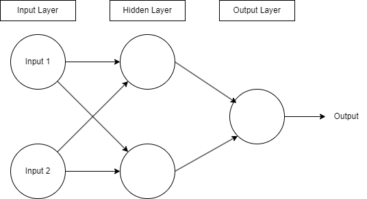

# Building XOR From Scratch

## Introduction

Welcome to Building XOR From Scratch! In this section, we delve into the basic concepts of neural networks, gradient descent, and backpropagation. Through detailed code examples, we aim to show how these methods enable a network to learn and accurately replicate the XOR function.

## Overview

This directory contains:
- **Code examples**: Demonstrating the implementation of the XOR function using a neural network.
- **Explanations**: Brief descriptions of the neural network components, gradient descent, and backpropagation.

## Detailed Explanation

For a more comprehensive understanding, I encourage you to read the full post on Medium. In this post, we cover the fundamental concepts of neural networks, gradient descent, and backpropagation in detail. We hope that through these code examples, you will gain a clear understanding of how these methods work together to enable a network to learn and accurately replicate the XOR function.

Read the full post on Medium: [Implementing XOR Using Neural Networks](https://medium.com/@derek246810/building-an-xor-neural-network-from-scratch-learn-from-the-basics-63a2a22495ae)