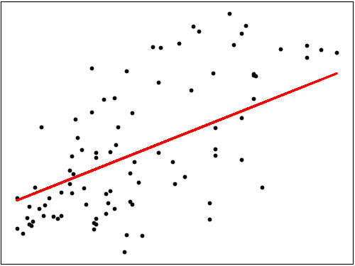

# Popular Machine Learning Algorithms breakdown Supervised Learning

## Introduction

Welcome to Popular Machine Learning Algorithms breakdown-Supervised Learning! In this section, we dive into some of the popular Machine Learning algorithms and provide them with scikit-learn implementations and some implmentations from scratch.

## Overview

This directory contains:
- **Code examples**: Demonstrating the implementation of the ML algorithms.
- **Explanations**: Explanation on these algorithms and how to evaluate them.
- **Table of Contents**:
    - Linear regression
    - Support Vector Machine
    - K-Nearest Neighbors
    - Decision Tree
    - Random Forest
    - Logistic Regression
    - Naive Bayes

## Detailed Explanation

For a more comprehensive understanding, I encourage you to read the full post on Medium. In this post, we cover some of the popular supervised learning algorithms and thier implementations using scikit-learn.

Read the full post on Medium: [Popular Machine Learning Algorithms breakdown-Supervised Learning](***)